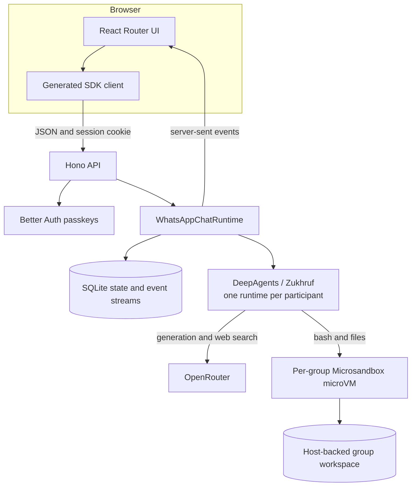
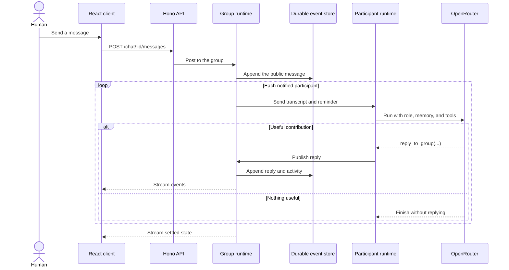

# Blackboard

Blackboard powers [Baseera](https://baseera-28e96a-167-233-88-12.sslip.io), a
group chat where one person works with a team of AI agents. Create a group from
curated specialists, speak to one agent or the whole room, and keep the group's
files and tools in an isolated workspace.

Agents can search the web, work with files, schedule follow-ups, create new
participants, and publish artifacts back to the chat. Passkey authentication,
durable conversations, read-only share links, and agent traces are built in.

## Core model

A group contains up to eight participants. Each participant has a name, a
persona, operating instructions, and durable memory. The runtime sends every
new public message to the relevant participants. An agent posts only when it
has a useful contribution; otherwise, it stays silent. A round ends when the
group settles or reaches a safety limit.

The built-in **Factory** participant creates and updates custom agents. Start a
message with `Factory` or `@Factory`:

```text
Factory, create a customer researcher named Maya.
```

## Architecture



The React client uses a generated SDK for request types and opens an event
stream for live messages, presence, and activity. The Hono API authenticates
the caller, enforces group ownership, and routes work to the group runtime. The
runtime persists events before projecting them into the UI and group list.

Each participant runs through DeepAgents and Zukhruf with its own context,
mailbox, schedule queue, and telemetry. Participants share one group workspace,
but each group runs in a hardware-isolated Microsandbox microVM with network
access disabled. OpenRouter supplies the language model, web search, and voice
transcription.

## Message flow



Agent replies become new public messages, so another round can begin. Durable
streams let the server rebuild a conversation after a restart. Notification,
message, and transcript limits stop runaway agent loops.

## Agents and workspaces

Custom participants live under the user's hashed directory:

```text
$ZUKHRUF_DATA_DIR/participants/<user-hash>/<agent>/
├── identity.json  # host-visible name
├── SOUL.md        # persona and voice
├── AGENTS.md      # operating instructions
└── MEMORY.md      # durable knowledge
```

At the start of each turn, the agent reads these files from
`/workspace/participants`. Custom definitions are writable and shared across
that user's groups. Bundled participants and the catalog are mounted read-only.
New agents join new chats; updates to existing agents apply on their next turn.

Every group receives a persistent workspace at:

```text
$ZUKHRUF_DATA_DIR/sandboxes/<group-hash>/workspace
```

Files written to `/workspace/output` appear through the authenticated artifact
route. The API rejects paths outside that directory.

## Durable state

All application state stays under `ZUKHRUF_DATA_DIR`:

| Data                                         | Storage                                      |
| -------------------------------------------- | -------------------------------------------- |
| Users, passkeys, and sessions                | `auth.sqlite`                                |
| Groups, messages, context, and event streams | `group.sqlite`                               |
| Agent mailboxes and scheduled turns          | `mailbox.sqlite` and `queues/`               |
| Marketplace templates and share links        | `group-templates.sqlite` and `shares.sqlite` |
| Custom agents and execution traces           | `participants/` and `group-telemetry/`       |
| Group files and published artifacts          | `sandboxes/`                                 |

## Repository map

| Path             | Responsibility                                                         |
| ---------------- | ---------------------------------------------------------------------- |
| `apps/web`       | React Router interface, live group chat, templates, shares, and traces |
| `apps/api`       | Hono API, authentication, group runtime, persistence, and sandboxes    |
| `packages`       | Shared annotation, input, voice, and UI packages                       |
| `participants`   | Built-in participant definitions, including Factory                    |
| `catalog/agents` | Read-only specialist catalog and workspace templates                   |
| `deploy/dokploy` | Production image, Compose service, smoke test, and deployment script   |

## Local development

You need Node.js 22.22 or newer, npm 11, and an OpenRouter API key.
Microsandbox requires Apple silicon or Linux with KVM.

```bash
cp .env.example apps/api/.env
# Set OPENROUTER_API_KEY in apps/api/.env.
# Set BETTER_AUTH_SECRET to a random value with at least 32 characters.
npm install
npx msb doctor
nx run-many -t portless -p web api
```

Run `portless trust` once if the local certificate is not installed, then open
`https://frontend.baseera.localhost`. Create a passkey with your name; returning
users sign in with the same device passkey.

## Checks

```bash
nx run api:typecheck
nx run web:typecheck
nx run ui:typecheck
nx run api:test
nx run web:test
```
